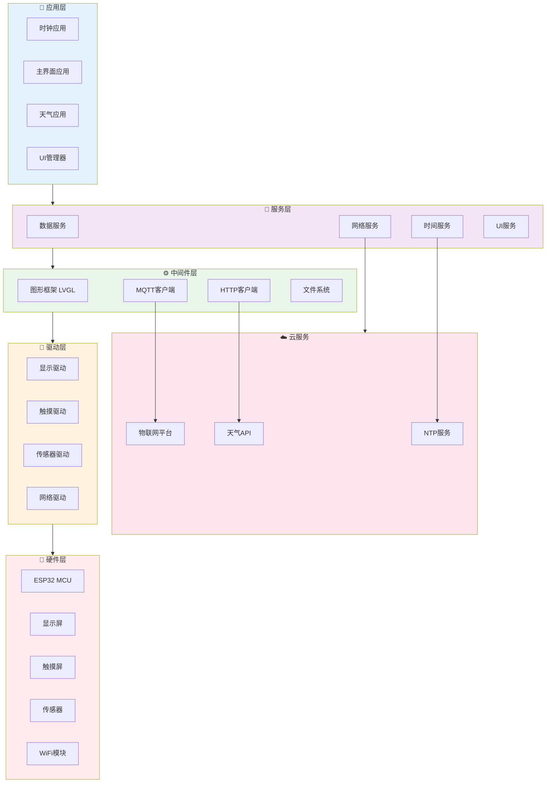

# ESP32_WATCH_IOT
一个基于 ESP32 + LVGL + FreeRTOS 的智能手表项目，实现了多界面切换、天气显示、温湿度监测、MQTT物联网上报、~~二次元客制化主题~~。

> 本项目作为我简历上的一个项目的过程汇报   

## 项目简介

本项目旨在打造一个具有多功能交互界面的 ESP32 智能手表。
使用 **LVGL 9.3** 实现 UI，运行在 **FreeRTOS** 上，支持联网获取天气数据并通过 **OneNET IoT 平台** 上报传感器信息。

## 开发环境
>* **Platform:** ESP-IDF 5.3.4
>* **Language:** C (FreeRTOS + LVGL 9.3)
>* **Display:** ST7789 (240x280)
>* **Sensor:** DHT11
>* **Network:** WiFi + HTTP/MQTT
>* **IDE:** VSCode + ESP-IDF Plugin

## 功能进度总览

| 模块 | 状态 | 附加说明 |
|------|-----------|------|
|  **Clock 页面** | ✅ 已完成 |   |
|  **主界面（TileView）** | ✅ 已完成 |  |
|  **天气模块** | ✅ 已完成 |  |
|  **温湿度监测** | ✅ 已完成 |  |
|  **OneNET 数据上报** | ✅ 已完成 |  |
|  **UI 动画与滚动文本** | ✅ 已完成 |  |
|  **WiFi联网** | ✅ 已完成 |  |
|  **WS2812 GIF联动控制** | 🚧 开发中 |  |
|  **OTA 升级机制** | 🚧 开发中 |  |
|  **电量管理显示** | 🚧 开发中 |  |

## 📁 项目结构

## 📦 未来计划

* [ ] 添加 BLE 控制功能
* [ ] 增加表盘切换动画
* [ ] 图片资源管理
* [ ] 小说阅读器
* [ ] 视频播放器
* [ ] 自定义部件、装饰、主题

---

